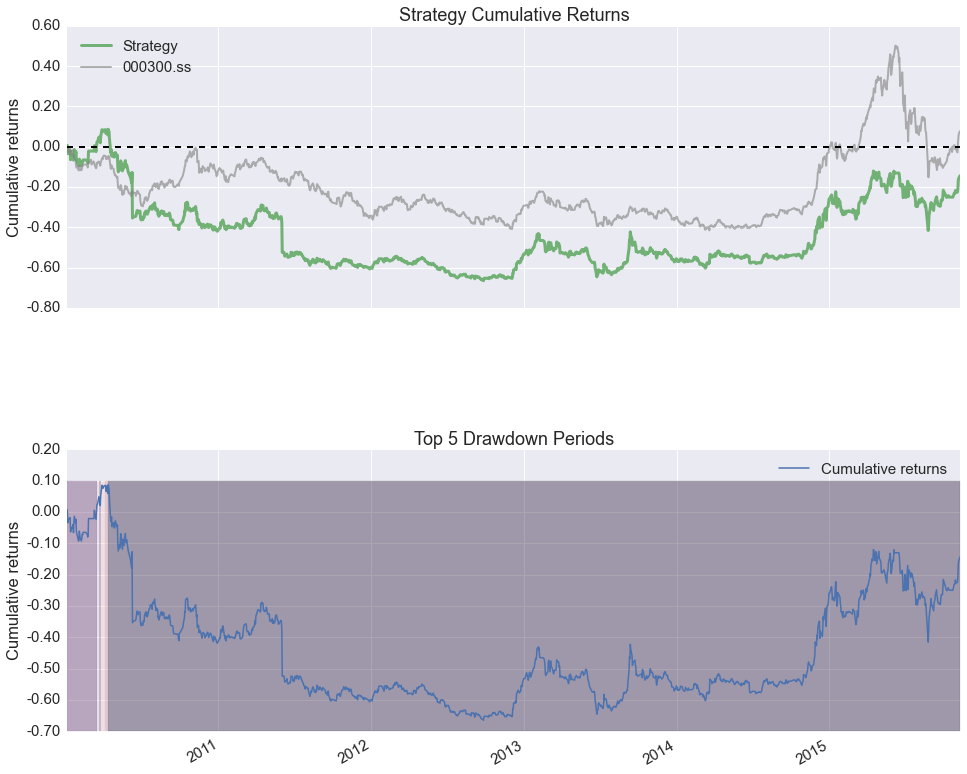
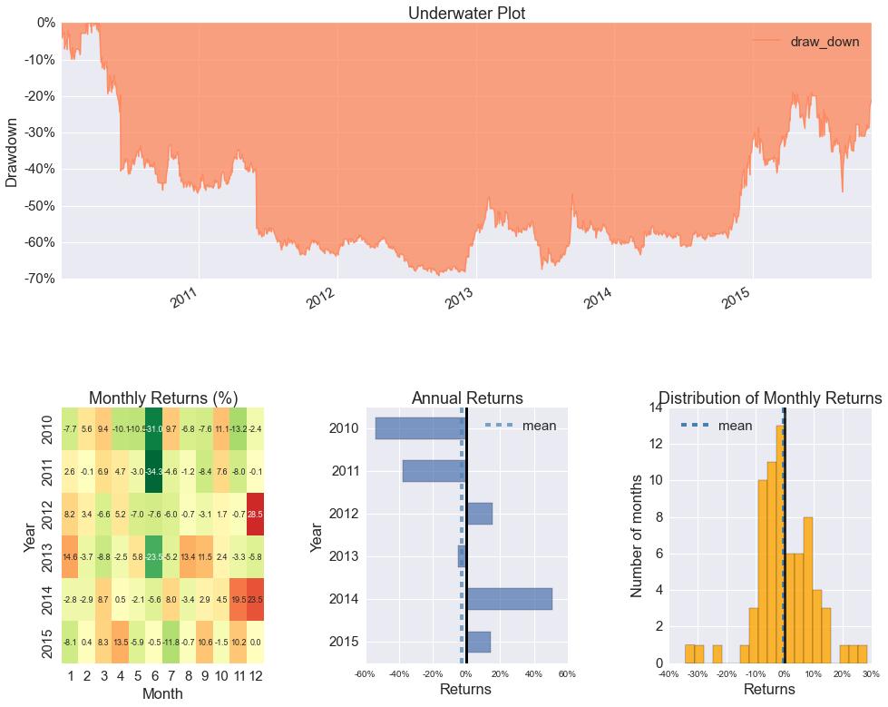
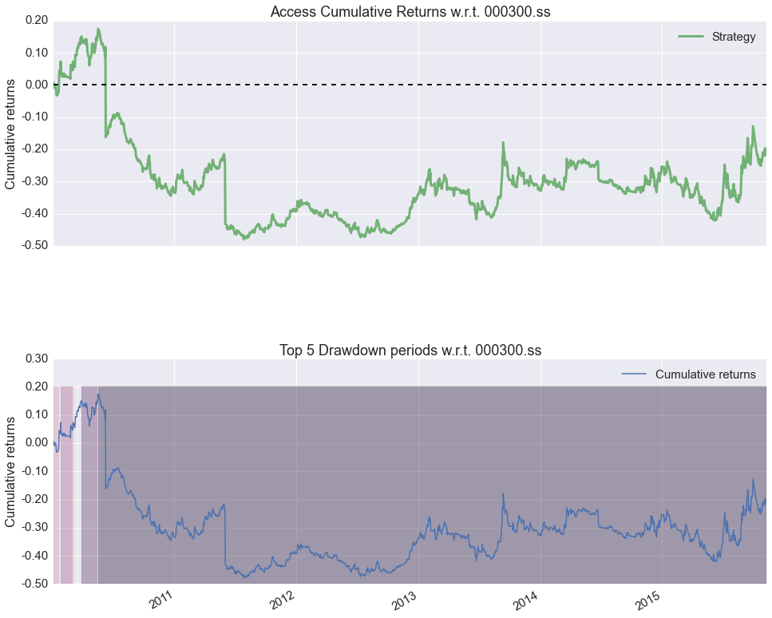
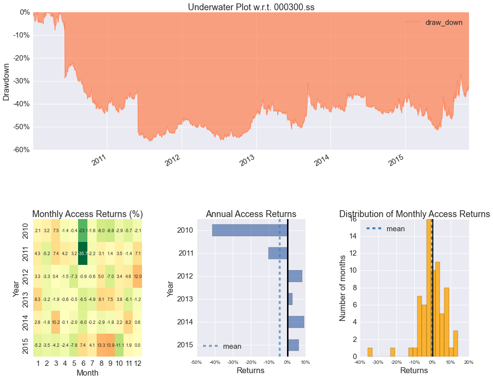

## VisualPortfolio
----------------------

将策略或者资产包的表现可视化。大量参考以及模仿自[pyfolio](https://github.com/quantopian/pyfolio)，包括图的配置以及代码。

## 依赖
----------------------

~~~
matplotlib
numpy
pandas
seaborn
~~~

## 安装
----------------------

首先将代码``clone``至本地：

~~~
git clone https://github.com/ChinaQuants/VisualPortfolio.git (如果你是从github获取)
~~~

安装

~~~
cd VisualPortfolio
python setpy.py install
~~~

## 例子
----------------------

~~~python
In [1]: %matplotlib inline
In [2]: from VisualPortfolio import createPerformanceTearSheet
In [3]: from pandas_datareader import data
In [4]: prices = data.get_data_yahoo('600000.ss')['Close']
In [5]: benchmark = data.get_data_yahoo('000300.ss')['Close']
......: benchmark.name = "000300.ss"
In [6]: perf_matric, perf_df = createPerformanceTearSheet(prices=prices, benchmark=benchmark)
~~~

